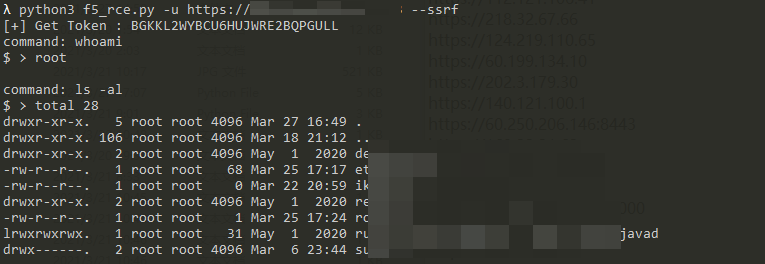

# 使用

```
python3 f5_rce.py 

-u 指定目标URL
-f 批量检测文件
-c 执行命令
-s/--ssrf 通过ssrf获得token执行命令
```

效果如下所示：


```
python3 f5_rce.py -u 127.0.0.1 --ssrf
```
执行命令后输入`exit`退出



PS：输出不够美感，我会修改的😁

# 后续

更新：
+ 修改部分命令执行异常情况
+ 增加SSRF获取Token执行命令

~~1. 正则匹配，美化输出~~
~~2. 更新其他poc利用方式~~

# 引用

+ [poc地址](https://twitter.com/wugeej/status/1372392693989445635)
+ [脚本小子是如何复现漏洞(CVE-2021-22986)并实现批量利用](https://mp.weixin.qq.com/s/cavKq04hNU5pJoTBiPMZkw)
+ [CVE-2021-22986](https://github.com/Al1ex/CVE-2021-22986)


